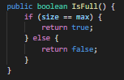
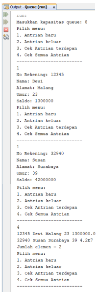
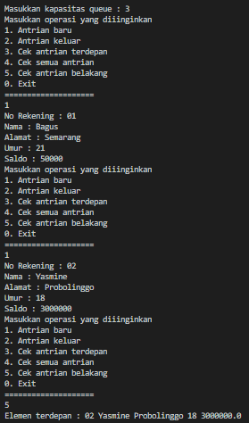

## **
Jobsheet 8 (Queue)
**

>
Nama : Bagus Dwi Putranto

>Kelas : 1F D4 TI

>Nomer Absen : 08

>NIM : 2141720079

 

### 8.1 Tujuan Praktikum
Setelah melakukan materi praktikum ini, mahasiswa mampu:
1. Mengenal struktur data Queue
2. Membuat dan mendeklarasikan struktur data Queue
3. Menerapkan algoritma Queue dengan menggunakan array

### 8.2 Praktikum 1
Waktu percobaan : 45 menit
Pada percobaan ini, kita akan mengimplementasikan penggunaan class Queue.

### 8.2.1 Langkah-langkah Percobaan
1. Perhatikan Diagram Class Queue berikut ini:

2. Buat package dengan nama Praktikum1, kemudian buat class baru dengan nama Queue.
3. Tambahkan atribut-atribut Queue sesuai diagram class, kemudian tambahkan pula 
konstruktornya seperti gambar berikut ini.

4. Buat method IsEmpty bertipe boolean yang digunakan untuk mengecek apakah queue kosong.

5. Buat method IsFull bertipe boolean yang digunakan untuk mengecek apakah queue sudah penuh.

6. Buat method peek bertipe void untuk menampilkan elemen queue pada posisi paling depan.

7. Buat method print bertipe void untuk menampilkan seluruh elemen pada queue mulai dari posisi front sampai dengan posisi rear.

8. Buat method clear bertipe void untuk menghapus semua elemen pada queue

9. Buat method Enqueue bertipe void untuk menambahkan isi queue dengan parameter dt yang 
bertipe integer

10. Buat method Dequeue bertipe int untuk mengeluarkan data pada queue di posisi belakang

11. Selanjutnya, buat class baru dengan nama QueueMain tetap pada package Praktikum1. Buat 
method menu bertipe void untuk memilih menu program pada saat dijalankan.

12. Buat fungsi main, kemudian deklarasikan Scanner dengan nama sc.

13. Buat variabel n untuk menampung masukan berupa jumlah maksimal elemen yang dapat 
disimpan pada queue.

14. Lakukan instansiasi objek Queue dengan nama Q dengan mengirimkan parameter n sebagai 
kapasitas elemen queue

15. Deklarasikan variabel dengan nama pilih bertipe integer untuk menampung pilih menu dari 
pengguna.

16. Lakukan perulangan menggunakan do-while untuk menjalankan program secara terus menerus 
sesuai masukan yang diberikan. Di dalam perulangan tersebut, terdapat pemilihan kondisi 
menggunakan switch-case untuk menjalankan operasi queue sesuai dengan masukan pengguna.

17. Compile dan jalankan class QueueMain, kemudian amati hasilnya.

### 8.2.2 Verifikasi Hasil Percobaan

Samakan hasil compile kode program Anda dengan gambar berikut ini.

 

### 8.2.3 Pertanyaan
1. Pada konstruktor, mengapa nilai awal atribut front dan rear bernilai -1, sementara atribut size bernilai 0?
>Jawab : **Kerena pada saat awal program dijalankan queue masih kosong, jadi front dan rear masih berada pada indeks -1 (diluar queue), dan size = 0 karena queue belum terisi**

2. Pada method Enqueue, jelaskan maksud dan kegunaan dari potongan kode berikut!

>Jawab : **Pada method Enqueue berparameter dt berisikan algoritma jika array sudah terisi penuh (IsFull) maka akan ada perintah untuk print tulisan "Queue sudah penuh", selain itu pada method Enqueue berparameter dt memiliki 3 kondisi yaitu :**
- **jika Queue kosong (IsEmpty) maka nilai front dan rear = 0 (Kondisi dimana queue sedang kosong)**
- **jika nilai rear sama dengan nilai max yang telah dikurangi 1 maka nilai rear akan menjadi 0 (Kondisi dimana jika nilai rear berada pada indeks terakhir)**
- **Selain dari kedua kondisi diatas maka nilai rear akan di increment (Kondisi dimana selain dari 2 kondisi diatas).**
>**Kemudian setelah melewati pemilihan kondisi array yang berindeks rear (data[rear]) memiliki nilai yang sama dengan parameter method Enqueue (dt), lalu nilai size di increment**

3. Pada method Dequeue, jelaskan maksud dan kegunaan dari potongan kode berikut!

>Jawab : **Pada method Dequeue berisikan algoritma pendeklarasian variable dt dengan tipe data interger, lalu jika array masih kosong (IsEmpty) maka akan ada perintah untuk print tulisan "Queue masih kosong", selaint itu maka nilai dt = array queue dengan indeks ke front (dt = data[front]) maka nilai size akan di decrement, kemudian lanjut pada sesi pemilihan kondisi, method Dequeue memiliki 3 kondisi yaitu :**
- **jika Queue kosong (IsEmpty) maka nilai front dan rear = -1 (Kondisi dimana queue sedang kosong)**
- **jika nilai front sama dengan nilai max yang telah dikurangi 1 maka nilai front akan menjadi 0 (Kondisi dimana jika nilai front berada pada indeks terakhir)**
- **Selain dari kedua kondisi diatas maka nilai front akan di increment (Kondisi dimana selain dari 2 kondisi diatas).**
>**Kemudian nilai dt akan dikembalikan, yang mana nilai dt adalah 0, maksud dari itu adalah mengubah indeks front menjadi 0 = data kosong/terambil.**

4. Pada method print, mengapa pada proses perulangan variabel i tidak dimulai dari 0 (int i=0), melainkan int i=front?
>Jawab : **Karena tidak selalu awal dari indeks yang bernilai itu bermulai dari indeks 0**

5. Perhatikan kembali method print, jelaskan maksud dari potongan kode berikut!

>Jawab : **Jika array masih kosong (IsEmpty) makan akan ada perintah untuk print tulisan "queue masih kosong, selain itu deklarasi variable i dengan tipe data interger, dimana i = front, ketika i tidak sama dengan nilai rear maka akan melakukan print array indeks ke i, lalu nilai i = i ditambah 1 kemudian sisa bagi  max. Setelah itu print array indeks ke i dan print "Jumlah elemen = size.**

6. Tunjukkan potongan kode program yang merupakan queue overflow!
>Jawab : 

7. Pada saat terjadi queue overflow dan queue underflow, program tersebut tetap dapat berjalan dan hanya menampilkan teks informasi. Lakukan modifikasi program sehingga pada saat terjadi queue overflow dan queue underflow, program dihentikan!
>Jawab : 

### 8.3 Praktikum 2
Waktu percobaan : 45 menit
Pada percobaan ini, kita akan membuat program yang mengilustrasikan teller di bank dalam 
melayani nasabah.

### 8.3.1 Langkah-langkah Percobaan
1. Perhatikan Diagram Class berikut ini:

2. Buat package dengan nama Praktikum2, kemudian buat class baru dengan nama Nasabah.

3. Tambahkan atribut-atribut Nasabah seperti pada Class Diagram, kemudian tambahkan pula 
konstruktornya seperti gambar berikut ini.

4. Salin kode program class Queue pada Praktikum 1 untuk digunakan kembali pada Praktikum 2 ini. Karena pada Praktikum 1, data yang disimpan pada queue hanya berupa array bertipe integer, sedangkan pada Praktikum 2 data yang digunakan adalah object, maka perlu dilakukan modifikasi pada class Queue tersebut.

5. Lakukan modifikasi pada class Queue dengan mengubah tipe int[] data menjadi Nasabah[] data karena pada kasus ini data yang akan disimpan pada queue berupa object Nasabah. Modifikasi perlu dilakukan pada atribut, method Enqueue, dan method Dequeue.

 
 

6. Karena satu elemen queue terdiri dari beberapa informasi (norek, nama, alamat, umur, dan 
saldo), maka ketika mencetak data juga perlu ditampilkan semua informasi tersebut, sehingga 
meodifikasi perlu dilakukan pada method peek dan method print.

7. Selanjutnya, buat class baru dengan nama QueueMain tetap pada package Praktikum2. Buat 
method menu untuk mengakomodasi pilihan menu dari masukan pengguna

8. Buat fungsi main, deklarasikan Scanner dengan nama sc

9. Buat variabel max untuk menampung kapasitas elemen pada queue. Kemudian lakukan instansiasi objek queue dengan nama antri dan nilai parameternya adalah variabel jumlah.

10. Deklarasikan variabel dengan nama pilih bertipe integer untuk menampung pilih menu dari 
pengguna.

11. Tambahkan kode berikut untuk melakukan perulangan menu sesuai dengan masukan yang 
diberikan oleh pengguna.

12. Compile dan jalankan class QueueMain, kemudian amati hasilnya.

### 8.3.2 Verifikasi Hasil Percobaan

Samakan hasil compile kode program Anda dengan gambar berikut ini.

### 8.3.3 Pertanyaan
1. Pada class QueueMain, jelaskan fungsi IF pada potongan kode program berikut!

>Jawab : **Jika kebalikan dari nilai norek hanya "" (nilai norek tidak kosong) dan Jika kebalikan dari nilai nama hanya "" (nilai nama tidak kosong) dan Jika kebalikan dari nilai alamat hanya "" (nilai alamat tidak kosong) dan jika nilai umur tidak samadengan 0 (!= 0) dan jika nilai saldo tidak samadengan 0 (!= 0) maka akan melanjutkan perintah selanjutnya.**

2. Lakukan modifikasi program dengan menambahkan method baru bernama peekRear pada class Queue yang digunakan untuk mengecek antrian yang berada di posisi belakang! Tambahkan pula daftar menu 5. Cek Antrian paling belakang pada class QueueMain sehingga method peekReardapat dipanggil!

>pada class Queue :

 

>pada class QueueMain :

>output :

1. Tambahkan dua method berikut ke dalam class Queue pada Praktikum 1:
>a. Method peekPosition(data: int) : void Untuk menampilkan posisi dari sebuah data di dalam queue, misalnya dengan mengirimkan data tertentu, akan diketahui posisi (indeks) data tersebut berada di urutan ke berapa
>b. Method peekAt(position: int) : void Untuk menampilkan data yang berada pada posisi (indeks) tertentu Sesuaikan daftar menu yang terdapat pada class QueueMain sehingga kedua method tersebut dapat dipanggil!

>a. peekPosition :

 

>b. peekAt :

 

2. Buatlah program antrian untuk mengilustasikan mahasiswa yang sedang meminta tanda tangan 
KRS pada dosen DPA di kampus. Ketika seorang mahasiswa akan mengantri, maka dia harus 
menuliskan terlebih dulu NIM, nama, absen, dan IPK seperti yang digambarkan pada Class 
diagram berikut:

 

### Keterangan:
- Method create(), isEmpty(), isFull(), enqueue(), dequeue() dan print(), kegunaannya sama seperti yang telah dibuat pada Praktikum
- Method peek(): digunakan untuk menampilkan data Mahasiswa yang berada di posisi antrian 
paling depan
- Method peekRear(): digunakan untuk menampilkan data Mahasiswa yang berada di posisi antrian paling belakang
- Method peekPosition(): digunakan untuk menampilkan posisi antrian ke berapa, seorang Mahasiswa berada. Pengecekan dilakukan berdasarkan NIM
- Method printMahasiswa(): digunakan untuk menampilkan data mahasiswa pada suatu posisi tertentu dalam antrian

